This plug-in brings 3D navigation to Unreal Engine. 

It's based off of this [GDC talk](https://www.gdcvault.com/play/1022016/Getting-off-the-NavMesh-Navigating), and this associated chapter in [Game AI Pro 3](https://www.gameaipro.com/GameAIPro3/GameAIPro3_Chapter21_3D_Flight_Navigation_Using_Sparse_Voxel_Octrees.pdf).

The original implementation of the algorithm comes from https://github.com/midgen/uesvon, and was heavily refactored, improved, and integrated into UE's navigation system.

# Features

## Seamless integration with UE's built-in navigation system. 
 
You don't have to use specific `MoveTo` functions in your code, but only the regular nodes you're already used to use for your 2D pathfinding queries.

Pathfinding queries are automatically executed asynchronously.

Regeneration of the navigation data is automatically done whenever you move objects in the scene, and asynchronously.

## Different pathfinding algorithms

* A-Star
* Theta-Star
* Lazy-Theta-Star

You'll find more informations about pathfinding below.

## Debug visualizations

Debug visualization options which allow you to draw the different layers of the octree, all the free and / or occluded voxels, the active paths of the flying actors in the world. 

## Pathfinder Helper Actor

There is a Pathfinding helper actor which adds visualizations of the steps used by the pathfinding algorithm in the navigation data. That helps to understand all the paths the algorithm explores before reaching the destination. It also prints out informations about the path, such as the number of visited nodes, to help you choose the best options.

# Limitations

There are currently a few limitations to the plug-in which may be addressed in the future:

* Although the navigation data is generated asynchronously, it's done on one thread only. Given the nature of the data (in an octree), it is possible to split the workload in 8.
* No support for level streaming. It's supported in the navigation system and with the 2d navmesh, but not in this plugin currently. Though there are plans to support it, it won't be possible to connect multiple octrees together to make an actor move from one to another.
* No smoothing of the generated paths by the pathfinding algorithms. It should be possible to use an algorithm such as [Centripetal Catmull–Rom spline](https://www.wikiwand.com/en/Centripetal_Catmull%E2%80%93Rom_spline).
* Detection of the occluded voxels is currently done using the physics engine overlap detection. It should be possible to do this asynchronously, or do like with the Recast implementation: store a representation of all the triangles in the scene in a buffer, and check overlap collisions on the CPU in one of the threads generating the data.

# Usage

## Setup

The first step is to add to the Navigation System settings configuration of your flying agents.

You need to open the project settings, then click on the `Navigation System` option under the `Game` section. Then, expand the `Supported Agents` array and add your agent properties.

You must select `SVONavigationData` both for the `Nav Data Class` and the `Preferred Nav Data`.

The `Agent Radius` property is very important, as this will control the size of the smallest voxels of the navigation data. The size of the voxels will be twice the agent radius.

You can create multiple flying agents with different radii. This will make the navigation system create multiple navigation data in the level.

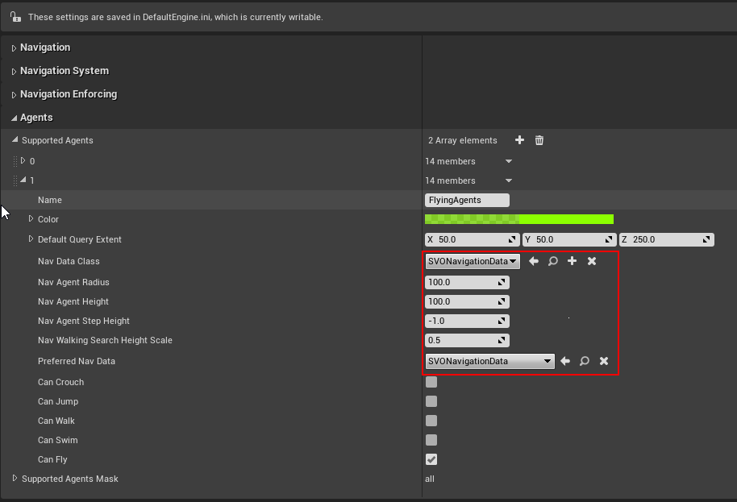

## Navigation Data

After you created your agent in the navigation system settings, you need to place a `Nav Mesh Bounds Volume` actor in your level, to let the navigation system create the `SVONavigationData` actor in the same level. That actor will contain the [sparse voxel octree](https://www.wikiwand.com/en/Sparse_voxel_octree) data used by the pathfinding.

It's important to note that the size of the octree generated by the plug-in won't necessarily be the same size as that volume. Indeed, because the navigation data starts with voxels with a pre-determined size (twice the agent radius), and because that navigation data is an octree, the plug-in must compute a total size that will allow the root cube to be split as many times as necessary to end up with the smallest cubes with the correct size.

You can visualize the real navigation bounds using the `Debug Infos . Debug Draw Bounds` option, as explained later.

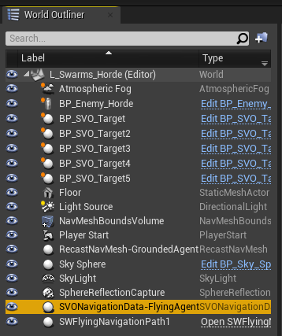

You can click on the actor to display some options:

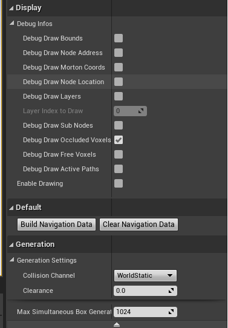

Even though the navigation data is generated automatically by the engine when it is added to the level, and you move actors around, it may be convenient to manually rebuild the data. You can use the 2 buttons to clear the navigation data, and rebuild it again.

You can use the `Collision Channel` setting to change the channel used by the physics engine overlap detection.

The `Clearance` option allows you to add an extra offset to the boxes used to test overlap. For example, if the agent radius is 100 units, then the smallest voxel size will be 200. If the clearance is set to 10, the size of the smallest voxels will be 210.

Explanations of the `Debug Infos` section are further down this document, but you can `Enable Drawing` and check `Debug Draw Layers` to make sure the data has been generated. If you moved and resized the `Nav Mesh Bounds Volume` to encompass some geometry, you should see some big yellow cubes in the viewport.

## AI Controller

The last step is to setup the flying actors. 

The easiest is to have an actor which inherit from `ACharacter`. You then need to select the character movement component, head to the `Nav Movement` section, and select `SVONavigationData` as their `Preferred Nav Data` class.

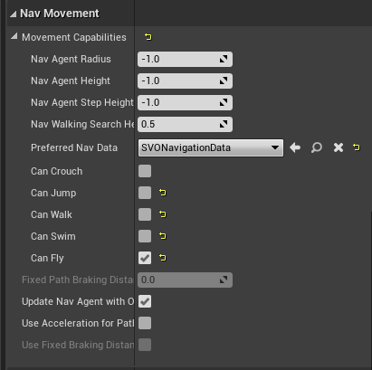

The next step is to create a blueprint from the class `SVONavigationQueryFilter`.


That class defines the options to use by the pathfinder. You can find the explanations of the various options below.

You can set this asset as the `Default Nav Filter Class` of the `AIController` of your flying actor.

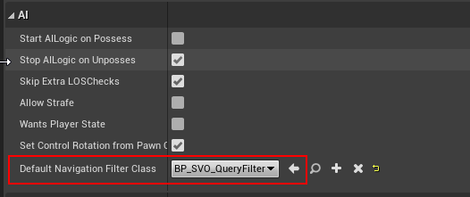

When it's done, you can for example use a behavior tree to move your actor, such as the following one:


To move the actor, you just need to use the `Move To` default node, and not forget to set the `Filter Class` option in the task properties.

You can visualize the paths used by your flying agents by checking `Enable Drawing` on the SVO navigation data actor, and checking `Debug Draw Active Paths`.

# Pathfinding options

As explained before, the navigation query filter allows you to define the pathfinding algorithm and options to use for your flying actor.

The first option is the path finder class. You can choose between 3 options:

* [A*](https://www.wikiwand.com/en/A*_search_algorithm) : this is a well known algorithm which is very fast to compute a path, but has the downside of producing very jaggy paths, as the path points will all be the centers of the voxels.
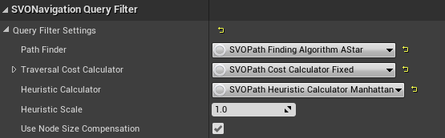

* [Theta*](https://www.wikiwand.com/en/Theta*): this algorithm uses A* as a base, but adds line-of-sight checks to allow the path to take shortcuts between points. It produces the most accurate paths of the 3, but is also the more expensive to compute.
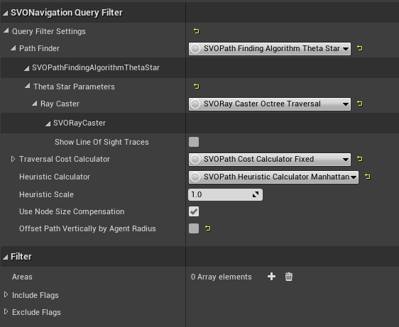

* [Lazy Theta*](http://idm-lab.org/bib/abstracts/papers/aaai10b.pdf): this is the default algorithm of the plug-in. It's a variation of Theta* which produces slightly less optimal paths, but is much less expensive as it generates much less line-of-sight checks.
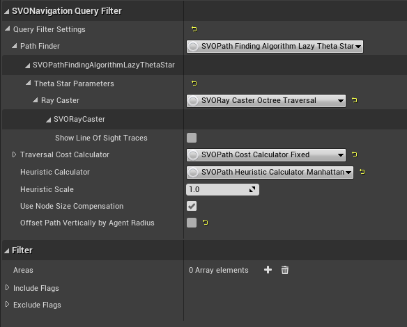

Theta* and Lazy Theta* both use Line of sight checks to shorten the path. The plug-in proposes 3 different methods to compute those LoS.

* Octree Traversal : this is a numeric algorithm based on the academic paper [An Efficient Parametric Algorithm for Octree Traversal](http://wscg.zcu.cz/wscg2000/Papers_2000/X31.pdf). This is the fastest of all 3 functions, and is the default.

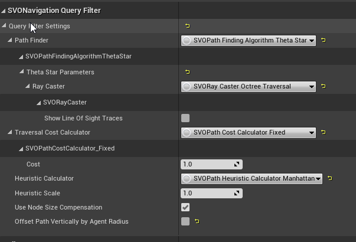

* Physics ray / sphere casts : this function uses the physics engine built-in RayCast / Sphere cast functions. It's less precise than the octree traversal function, but since it was implemented first, it was kept in case it's useful to anyone.

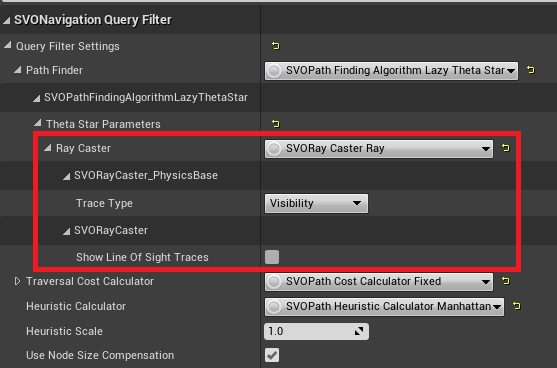
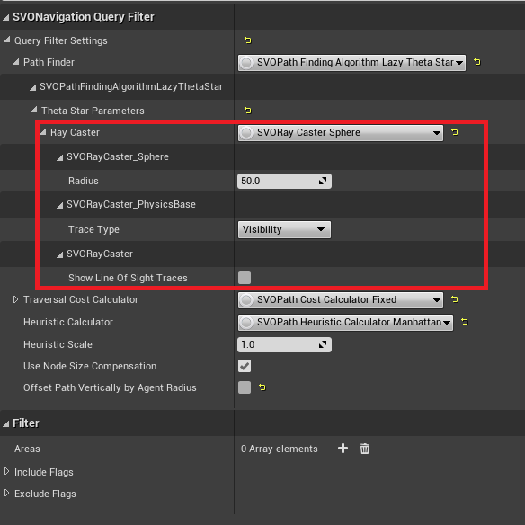

The next option of the query filter is `Traversal Cost Calculator`.

This option allows you to define how the path finder will compute how much it costs to go from a position to another. There are 2 options:

* Distance: this will simply return the distance between the 2 positions.
* Fixed: this will always return the same cost. From the Game AI Pro 3 article linked in the introduction, `This means that no matter how big the node is, traveling through it has the same cost. This effectively biases the search even more toward exploring through large nodes.`

The next options are for the heuristic cost.

`Heuristic Calculator` allows you to define how the path finder will compute how much it costs to go from a position to the target destination. You can choose between 2 options:

* Euclidean: this will simply return the distance between a position and the target destination.
* Manhattan: this will return the distance between the 2 positions using [taxicab geometry](https://www.wikiwand.com/en/Taxicab_geometry).

`Heuristic Scale` can be used to force the algorithm to prefer exploring nodes that it thinks are closer to the goal.

The last option, `Use Node Size Compensation`, is another optimization suggested by the paper. If enabled, both the traversal cost and the heuristic cost will be adjusted so that it's cheaper to go through big nodes than through small ones.

You can easily see the impact of all those options on the pathfinding computation by using the path finder test actor. See below for informations.

# Debugging

The plug-in comes with lots of visualization options to help you understand how the data is structured, and how to best set up the pathfinding.

## SVO Data Visualization

To see these visualizations, you first need to enable the `Navigation` visualization in the viewport.

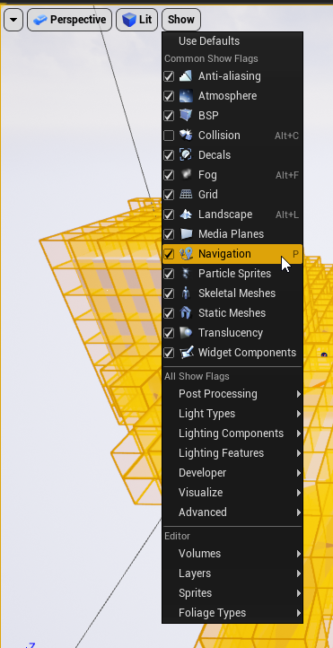

Then you need to select the SVONavigationData actor in the world outliner and check the `Enable Drawing` flag.

* `Debug Draw Bounds` : displays a white cube which represents the real size of the navigation data.

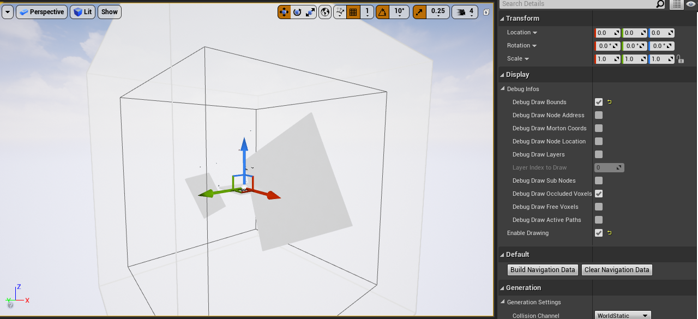

* `Debug Draw Occluded Voxels` and `Debug Draw Free Voxels` will display yellow cubes for the occluded voxels and green cubes for the free voxels, if you choose to draw the layers or the sub nodes.

* `Debug Draw Layers`: displays the intermediate layers of the octree, down to layer 0, which is the leaf nodes layer.

Layer 3
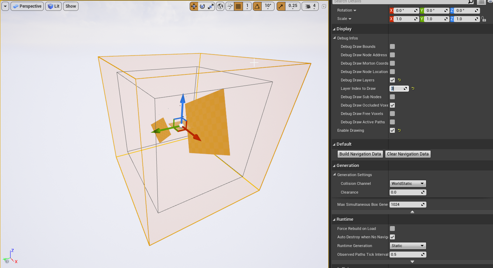

Layer 2
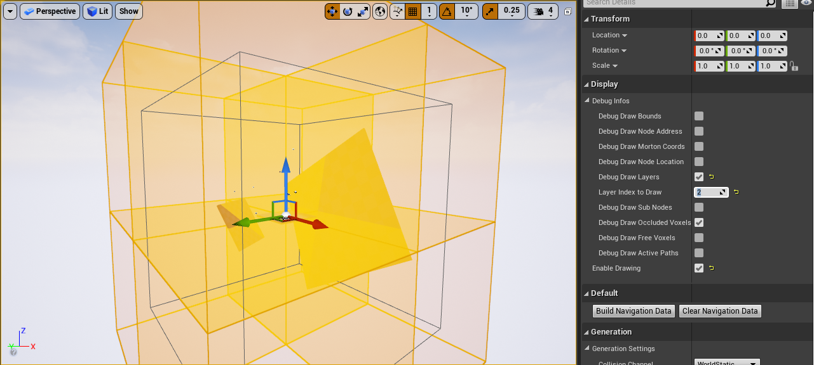

Layer 1
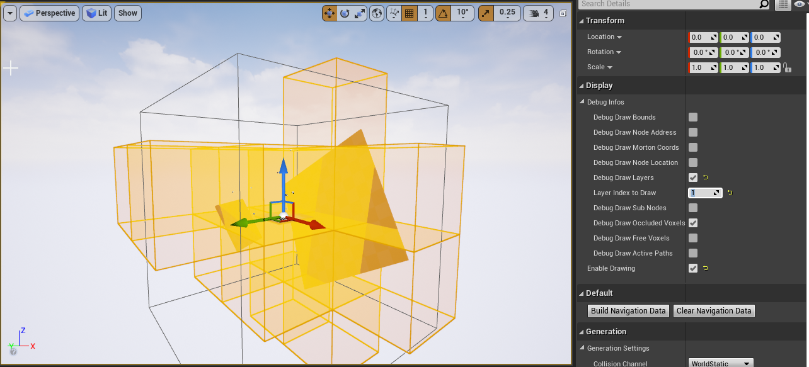
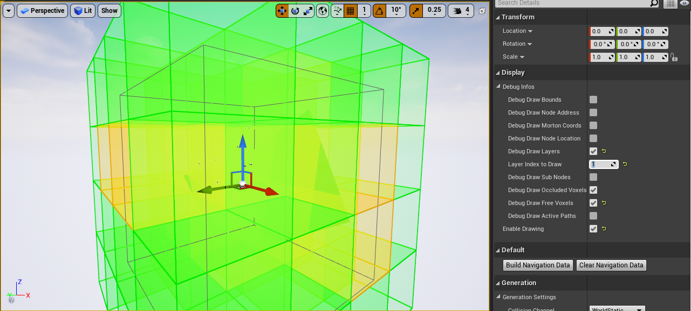

Layer 0
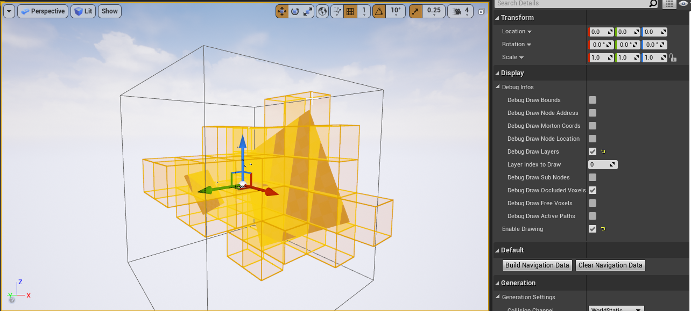


SubNodes
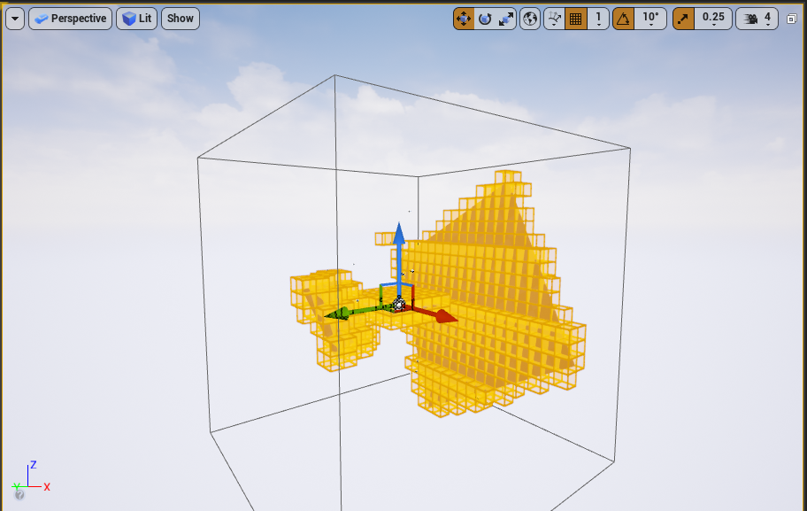


* `Debug Draw Node Address` will display the coordinates of each voxel in the layer you selected, or the subnodes.

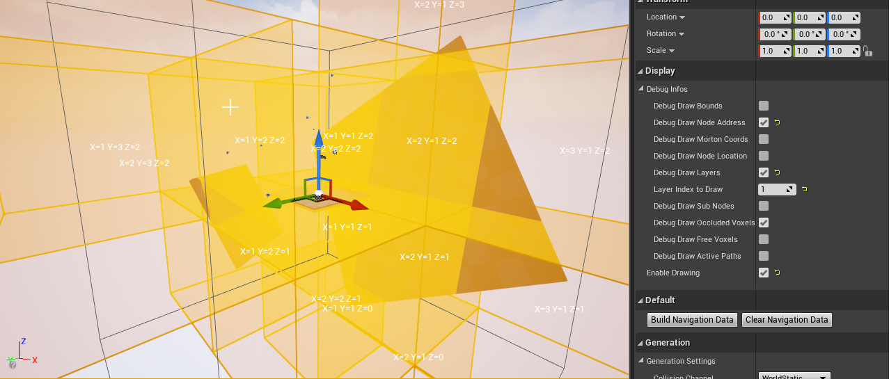

* `Debug Draw Morton Code` will display the morton code of each voxel in the layer you selected, or the subnodes.

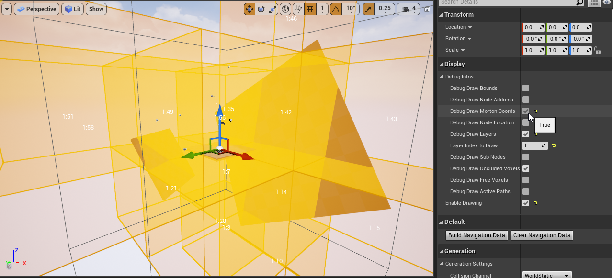

* `Debug Draw Active Paths` can be used while the game is running in the editor, and will display all the paths being used by your actors in the navigation data bounds.

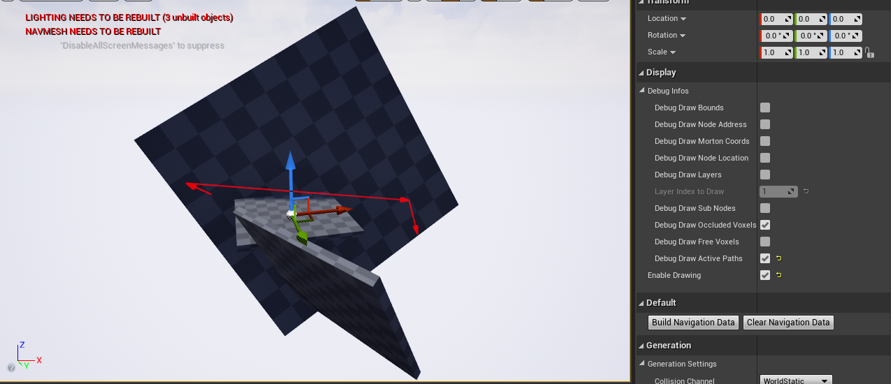

## Pathfinding Visualization

To test the pathfinding options, you can drag'n drop 2 actors of type `SVOPathFinderTest` in your world. 

Then select one of them, and set the other one as the `Other Actor`.

You can then set the `Preferred Nav Data` to `SVONavigationData` and the `Navigation Query Filter` to the blueprint class you created earlier.

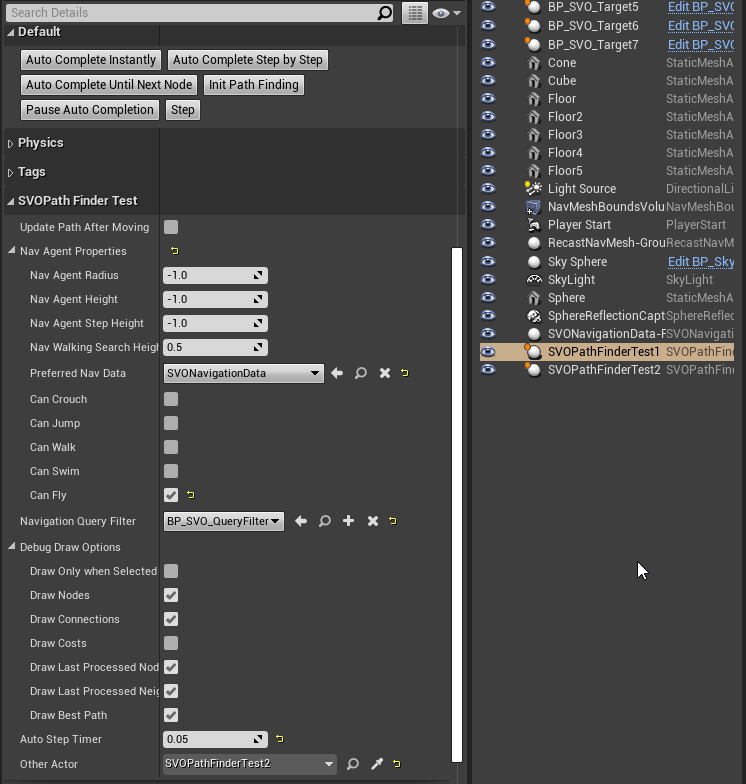

From there, you can use the buttons from one of the actors to initiate a pathfinding computation.

* `Auto Complete Instantly` will generate the path as soon as you click the button, and will display the result in the viewport

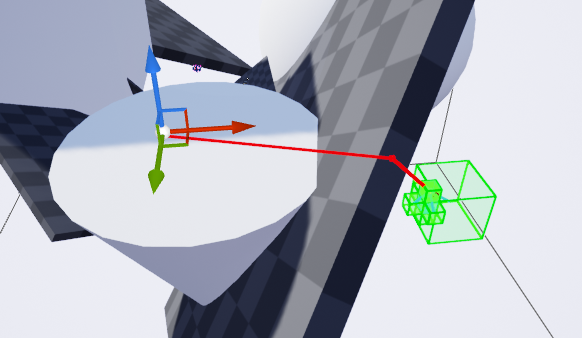

* `Auto Complete Step by Step` will show the algorithm working by processing each node one after each other after a small delay (which is configurable using the option `Auto Step Timer`). You can pause the execution with the button `Pause Auto Completion`.


* `Auto Complete Until Next Node` will process one node at a time, with all its neighbors, until a new node is pushed on the stack of nodes to process.

To compare the performance of the different pathfinding algorithms, you can use the `Path Finder Debug Infos` section which is filled with interesting informations after a path has been found.

For example, here are 3 benchmarks with various settinsgs for the Lazy Theta*:

```
Traversal Cost: Distance
Heuristic Cost: Manhattan
```
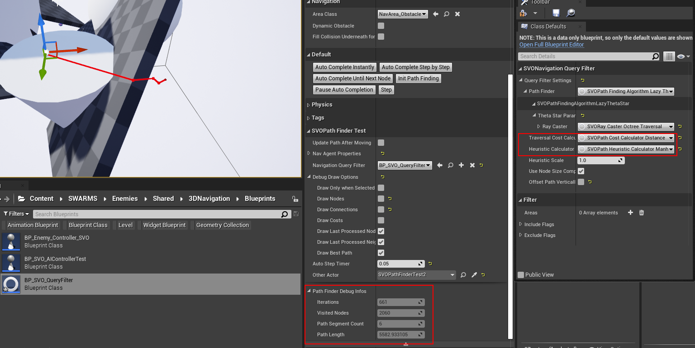

```
Traversal Cost: Fixed
Heuristic Cost: Manhattan
```
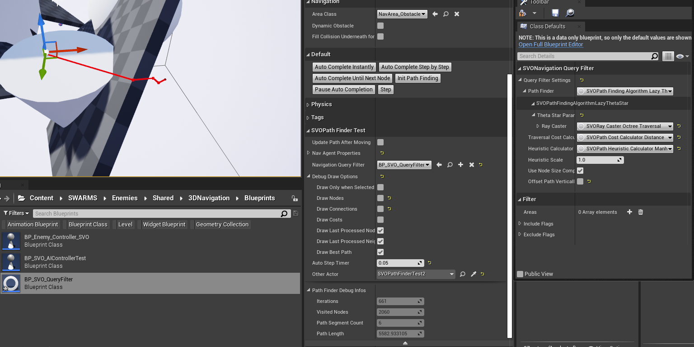

```
Traversal Cost: Fixed
Heuristic Cost: Distance
```
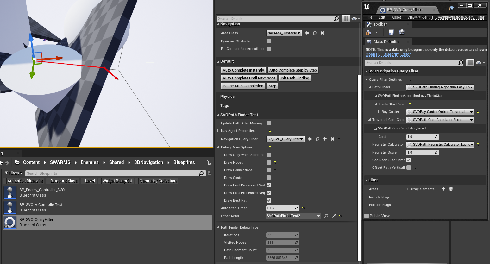

## Console commands

You can use the console command `CountNavMem` to display in the `OutputLog` the memory used by the navigation data.

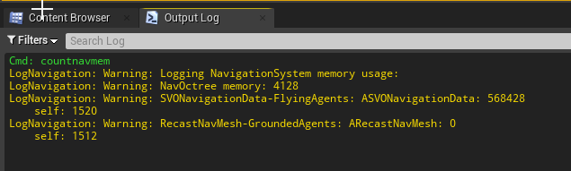
